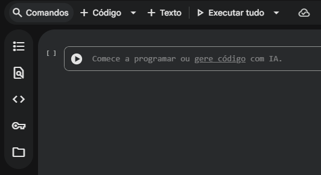
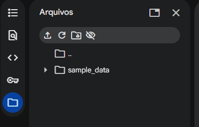
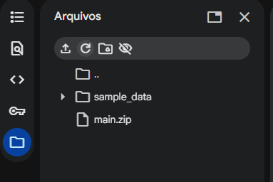

# Simulação e Análise de Espectros de Energia Nuclear

## Descrição
Projeto de computação científica para simular espectros de detectores nucleares e analisar sinais espectrais. Implementa tanto uma detecção clássica de picos (baseada em `scipy.signal`) quanto um pipeline robusto de detecção em duas etapas, utilizando Machine Learning (`IsolationForest`) para identificar anomalias no ruído.

## Autores
- Matheus Novello (236511)
- João Victor Pomiglio de Oliveira (250391)  
- Arthur Cesar (245730)
- André de Moraes Salvi (231323)

## Funcionalidades Principais
- **Simulação de Espectros:** Gera espectros realistas com fundo exponencial, múltiplos picos Gaussianos e ruído Poisson controlado.
- **Detecção Clássica:** Encontra picos usando filtros (`Savitzky-Golay`) e análise de parâmetros topológicos (proeminência, altura, largura) via `scipy.signal.find_peaks`.
- **Detecção com Machine Learning:** Identifica picos com alta robustez ao ruído através de um pipeline que aprende o que é "ruído de fundo" e depois encontra "anomalias" (os picos).
- **Análise e Fit:** Extrai parâmetros físicos precisos (Amplitude, Média-μ, Desvio-σ) de cada pico detectado através de ajuste de curvas (`curve_fit`).
- **Validação e Métricas:** Compara os picos detectados com os picos verdadeiros (em simulações) e gera um relatório de performance (`analise_metricas.py`).

## Metodologias de Detecção

O projeto implementa duas abordagens distintas para a detecção de picos:

### 1. Método Clássico (`detecta_picos.py`)
Esta abordagem usa um fluxo de trabalho tradicional de processamento de sinais:
1.  **Suavização:** Um filtro **Savitzky-Golay** é aplicado ao espectro para reduzir o ruído de alta frequência, preservando a forma dos picos.
2.  **Detecção:** A função `scipy.signal.find_peaks` é usada para encontrar máximos locais que atendam a critérios rigorosos definidos pelo usuário (ex: `altura_minima`, `proeminencia_minima`, `largura_minima`).
3.  **Resultado:** É muito rápido, mas seus resultados são altamente dependentes dos parâmetros de entrada, podendo gerar muitos falsos positivos em espectros com ruído complexo.

### 2. Método de Machine Learning (`deteccao_picos_ml.py`)
Esta é a abordagem mais avançada e robusta do projeto, ideal para espectros ruidosos. Ela opera em duas etapas:

1.  **Estágio 1: Detecção de Anomalias (com `IsolationForest`)**
    * Um modelo de Machine Learning (`IsolationForest` do Scikit-learn) é primeiro treinado com dados de **ruído puro**. Isso ensina o modelo a reconhecer o padrão estatístico de um "sinal normal" (o fundo).
    * O espectro real é então analisado pelo modelo. Pontos que **não** se encaixam no padrão de ruído (ou seja, são "anomalias") recebem um score negativo e são marcados como uma "região de interesse".

2.  **Estágio 2: Fit Gaussiano (`curve_fit`)**
    * As "regiões de interesse" identificadas pelo ML (que são os picos em potencial) são agrupadas.
    * Uma função Gaussiana (`scipy.optimize.curve_fit`) é então "encaixada" em cada uma dessas regiões.
    * Este "fit" estatístico extrai os parâmetros físicos precisos (amplitude, média, desvio padrão) de cada pico, rejeitando aqueles que não se parecem com uma curva Gaussiana ou que estão abaixo de um limite de amplitude.

## Como Instalar as Bibliotecas

**Nota Importante:** A estrutura do projeto requer que a maioria dos comandos sejam executados de dentro da pasta `main`.

1.  **Clone o repositório**
    ```bash
    git clone [URL_DO_REPOSITORIO]
    cd [NOME_DO_REPOSITORIO]
    ```

2.  **Crie e ative um ambiente virtual (`.venv`)**
    Recomendamos fortemente o uso de um ambiente virtual para isolar as dependências.

    *No Windows (PowerShell):*
    ```powershell
    # Use o executável do Python que você deseja usar (ex: Python 3.11)
    python -m venv .venv
    .\.venv\Scripts\Activate.ps1
    ```
    *(Se você receber um erro de "execução de scripts foi desabilitada", execute este comando uma vez: `Set-ExecutionPolicy -Scope CurrentUser RemoteSigned` e pressione 'S')*

    *No macOS ou Linux (Ubuntu):*
    ```bash
    # Use o executável do Python que você deseja usar (ex: python3)
    python3 -m venv .venv
    source .venv/bin/activate
    ```

3.  **Instale as dependências**
    O arquivo `requirements.txt` está dentro da pasta `main`.
    ```bash
    # Certifique-se de que seu .venv está ativo
    pip install -r main/requirements.txt
    ```
    *(Se encontrar erros de `ModuleNotFoundError` mesmo após a instalação, seu `pip` pode estar instalando pacotes "globais". Use este comando para forçar a instalação dentro do .venv: `pip install --target=.\.venv\Lib\site-packages --ignore-installed -r main\requirements.txt`)*

**Observação:** Se houver erros de bibliotecas não encontradas talvez seja necessário abrir um novo terminal para que as bibliotecas recém instaladas possam ser acessadas.

## Como Executar Localmente

**Nota Importante:** O projeto não foi feito para ser executado com o comando  `python "nome_do_arquivo.py"`, pois a maioria dos arquivos são **módulos** (bibliotecas) e não scripts executáveis.

Apenas os scripts de **exemplo** (`exemplo_...`) e **detecção** (`deteccao_picos_ml.py`) são executáveis criados para fins demontrativos, afim de que o usuário possa se familiarilizar com o uso da biblioteca. 

As instruções abaixo são apenas para os **os arquivos corretos** que devem ser executados.

---

Recomenda-se que todos os testes sejam executados com o ambiente virtual **ativo** para impedir conflitos com outras bibliotecas já instaladasno sistema do usuário e de dentro da pasta `main`.

**Primeiro, entre na pasta `main`:**
```bash
# Estando na raiz do projeto (ex: /home/usuario/Analise-Espectros-Nuclear-novo)
cd main
```

**Execute o comando no terminal com o nome do arquivo de exemplo desejado `NOME_DO_ARQUIVO.py`:**
```bash
python NOME_DO_ARQUIVO.py
```

## Como Executar no Google Colab

Primeiramente faça o download do arquivo main.zip disponivel no repositorio.

Abra um novo notebook no google colaboratory e faça o upload do do arquivo main.zip no armazenamante da seeção.

### Passo 1:
Selecione o icone de pasta no canoto superior direito da janela:



Clique no simbolo de upolad e selecione o arquivo main.zip no local salvo em seu computador

### Passo 2:


O arquivo deverá aparecer na sua arvore de arquivos

### Resultado:


Em seguida execute o seguinte comando em uma celula para extrair os arquivos:


```python
# Estando na raiz do projeto (ex: /home/usuario/Analise-Espectros-Nuclear-novo)
!unzip main.zip
```

Em seguida é possivel executar qualquer exeplo disponivel na pada diretamente usando o comando subtituindo o NOME_DO_ARQUIVO pelo nome do programa desejado: 

```python
%run main/NOME_DO_ARQUIVO.py
```

Exemplo de uso:


```python
# Abre o exemplo exemplo_completo.py
%run main/exemplo_completo.py
```

Outra maneira é copiar e colar o código diretamente em uma celula e em seguida utilizar. Por fim, para usuarios avançados a bibloteca já estará disponovil para uso normal penas será necessario importa-la no inico do código:

```python
# Abre o exemplo exemplo_completo.py
import espectrotool
```